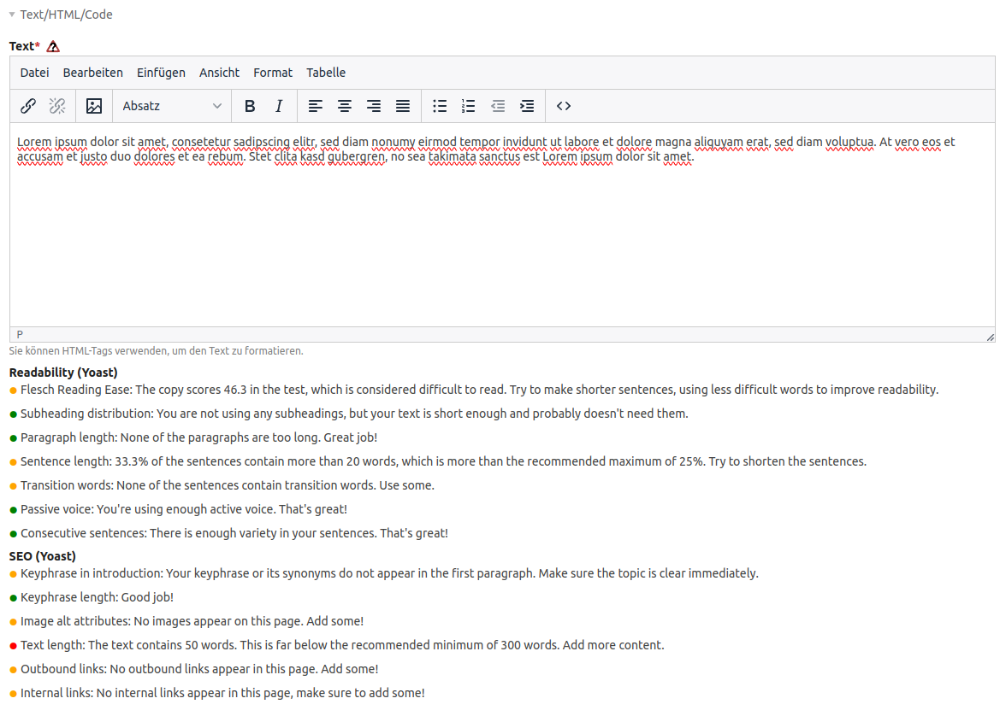

# Yoast SEO integration for Contao

## What does it do
This package extends the Contao backend with the [Yoast SEO](https://github.com/Yoast/wordpress-seo/tree/trunk/packages/yoastseo#yoastseojs) plugin.

For this, an input field named keyword gets created under the edit view of the Page structure.
And then on each text content field you get a display of the Yoast SEO results.

## Example
